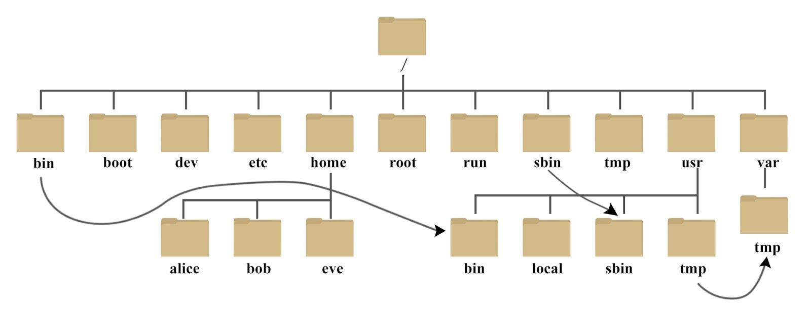
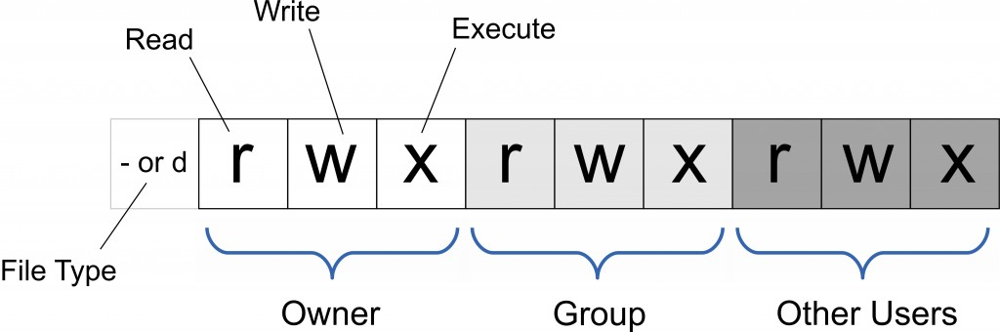
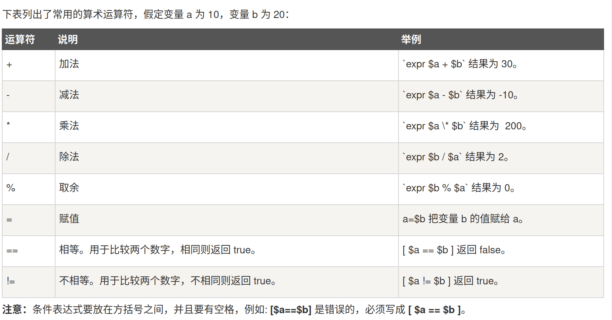

# 今天上午的内容
linux基础操作
- 终端快捷键
- 常用命令
- 简单bash脚本
我们今天用的是Linux发行版之一的Ubuntu Desktop

Ubuntu Desktop是由Canonical开发的Linux 发行版，由于其易用性，它是最受欢迎的发行版之一。它也是刚开始使用 Linux 的人的首选之一

那么什么是 Linux 发行版？它是由 Linux 内核开发的操作系统， 由 Linus Torvalds 于 1991 年创建的类 UNIX系统。Linux 发行版通常是免费和开源的，许多都是流行操作系统（如 Windows 和 macOS）的绝佳替代品

## linux终端快捷键
- **`Ctrl + Alt + t` 新建终端**
- `Shift + Ctrl + t` 在已有终端上打开新的tab
- `Ctrl + d` 关闭当前tab，若只有一个tab则关闭终端
- `Shift + Ctrl + q` 关闭当前终端，无论终端有几个tab
- `F11` 切换全屏/退出全屏
- `Ctrl + Shift + =` 放大终端字体
- `Ctrl + -` 缩小终端字体
- **`Ctrl + Shift + C` 复制**
- **`Ctrl + Shift + V` 粘贴**
- `鼠标滚轮` 如果用鼠标选中一段连续的文本，直接点击鼠标滚轮即可完成复制、粘贴的功能，粘贴位置在当前活动光标处
- `Alt + b`或`Alt + 键盘左键` 向前移动一个词的距离
- `Alt + f`或`Alt + 键盘右键` 向后移动一个词的距离
- `Esc + b`或`Esc + 键盘左键` 移动到当前单词的开头
- `Esc + f`或`Esc + 键盘右键`移动到当前单词的结尾 
- **`Ctrl + a` 移动光标到命令行首**
- **`Ctrl + e` 移动光标到命令行尾**
- **`Tab` 自动补全**
- **`Ctrl + w` 删除光标之前的一个词**
- **`Ctrl + u` 从当前光标所在位置向左全部删除**
- **`Alt + d` 删除光标之后的一个词**
- **`Ctrl + k` 从当前光标所在位置向右全部删除**
- **`向上向下箭头` 查看历史命令，只要按上下箭头即可，命令一个一个显示**
- `Ctrl + r` 查看历史命令，需要输入命令的起始字母，剩下的部分自动补全
- `Ctrl + g` 从历史搜索模式 `Ctrl + r` 退出
- **`Ctrl + c` 取消当前行输入的命令**
- `Ctrl + s` 暂停当前终端
- `Ctrl + q` 恢复当前终端
- **`Ctrl + l` 清空屏幕**
> **参考文章**<br>
> [Linux的shell终端常用快捷键大全](https://zhuanlan.zhihu.com/p/29538650)
## linux常用指令
- `ls`
  - 列出目录内容 (非以.开始的文件和目录) (以.开始的文件和目录会被隐藏) 
- `ls -a` 
  - 列出目录内容（所有的文件和目录）
- `ls -la`
  - 列出当前目录下的所有文件和目录的详细信息
- `ls -d *`
  - 列出当前目录下的目录名称，而不是目录下的内容。
- `pwd` 显示当前目录的绝对路径
- `mkdir` 
  - 语法`mkdir [-p] dirname`
  - 添加`-p`选项可以直接创建完整目录
- `whoami` 显示当前用户名
- `file filename` 显示指定文件的属性。
- `type -p commandname`
  - 显示命令 `commandname` 所在的地方
  - `which commandname` 也可以用来做这个
- `type commandname`
  - 显示命令 `commandname` 的信息。
- `whatis commandname`
  - 显示命令 `commandname` 的一句话帮助
- `man -a commandname`
  - 显示命令 `commandname` 的解释信息
***
#### linux目录结构

- `/` 根目录
- `~` 用户主目录( `/home/username(你的用户名)` 目录)
- `.` 当前目录
- `..` 上一级目录
>**参考文章**<br>
>[linux目录系统结构](https://www.runoob.com/linux/linux-system-contents.html)
***
- `cd <路径名>`
  - 切换到指定路径
  - p.s. 不要输入 `<` 和 `>` ，这个符号只是代表你应该在这个位置输入指定内容
- `cd -`
  - 切换到上一次所去的目录
- `touch <文件名路径>`
  - 创建文件
- `cp <文件1路径> <文件2路径>`
  - 拷贝一个已有的`文件1`到`文件2`。
- `rm <文件名路径>`
  - 删除文件
- `rm -r <文件目录>`
  - 删除目录
  - p.s. `-r`选项在许多linux命令中都会使用到，意思是使命令递归地对目录中所有文件执行，在想要对目录执行操作时，必须要加这个选项
- `mv` 移动文件命令
  - `mv <文件1> <文件2>`
    - 把已有的文件1重命名为文件2
  - `mv foo bar/baz`
    - 把已有的文件foo移动到新位置并重命名为bar/baz，目录bar必须存在
- `chmod` 控制用户对文件的权限
  - Linux/Unix 的文件调用权限分为三级 : 文件所有者（Owner）、用户组（Group）、其它用户（Other Users），每一级又有读、写、执行三个权限
  
  - 只有文件所有者和超级用户可以修改文件或目录的权限
  - 指定权限可以使用绝对模式（八进制数字模式）或者符号模式
  - 符号模式语法
    - `chmod <用户类型><操作符><权限>`
      - `<用户类型>`        
        - `u` 文件所有者
        - `g` 文件所有者所在组
        - `o` 所有其他用户
        - `a` 所有用户, 相当于ugo
      - `<操作符>`
        - `+` 为指定的用户类型增加权限
        - `-` 去除指定用户类型的权限
        - `=` 直接设置指定用户类型的权限
      - `<权限>`
        - `r` 读 设置为可读权限
        - `w` 写 设置为可写权限
        - `x` 执行 设置为可执行权限
    - e.g. `chmod u+x` 意思是给文件所有者增加执行权限
  - 绝对模式语法  
    - 三位二进制数代表相对应权限的有无，1即有0即无
    - 然后将二进制数转换为八进制数，以一位八进制数代表相应用户类型的权限
    - e.g. `chmod 777`即将文件所有者、文件所有者所在的用户组、其他用户的权限都设置为可读可写可执行
- `top`
  - 全屏显示进程信息。输入`q`退出
- `kill <进程号>`
  - 杀死指定进程
- `sudo`
  - `sudo` 的全称为：super user do 顾名思义：干超级用户才能干的事！所以sudo最常用的功能是在要执行的命令前加上，从而以超级管理员权限(root)执行命令
- `apt`
  - `apt`（Advanced Packaging Tool）是一个在 Debian 和 Ubuntu 中的 Shell 软件包管理器
  - `apt` 命令提供了查找、安装、升级、删除某一个、一组甚至全部软件包的命令，而且命令简洁而又好记
  - `apt` 命令执行需要超级管理员权限(root)
  - `apt` 常用命令
    - `sudo apt install <package_name>` 安装指定的软件命令
    - `sudo apt update` 查找更新，列出所有可更新的软件清单
    - `sudo apt upgrade` 升级所有可升级软件包
    - `sudo apt full-upgrade` 升级软件包，升级前会先删除需要更新软件包
    - `sudo apt upgrade <package_name>` 更新指定的软件命令
    - `sudo apt show <package_name>` 显示软件包具体信息,例如：版本号，安装大小，依赖关系等
    - `sudo apt remove <package_name>` 删除软件包命令
    - `sudo apt purge <package_name>` 移除软件包及配置文件
    - `sudo apt autoremove` 清理不再使用的依赖和库文件
    - `apt list --installed` 列出所有已安装的包
- `wget`
  - 你可以通过提供一个特定 URL 的链接，用 `wget` 下载一个文件。如果你提供一个默认为 `index.html` 的 URL ，那么就会下载该索引页。默认情况下，文件会被下载到你当前的工作目录，并保持原来的名字
  - 通过使用 `--output-document` （简写为 `-O`）和 `-` 符号，你可以指示 `wget` 将数据发送到 **标准输出**
  - 可以使用 `--output-document` 选项将下载文件命名为任何你想要的名称
  - 如果你正在下载一个超大文件，你可能会遇到下载中断的情况，使用 `--continue`（简写为 `-c`），`wget` 可以继续上次下载

> **参考文章**<br>
> [关于 Ubnutu Linux 终端的必知必会的 19 件超简单的事情 | Linux 中国](https://zhuanlan.zhihu.com/p/442995159)<br>
> [Ubuntu Manual | Ubuntu 参考手册](https://wiki.ubuntu.com.cn/UbuntuManual)<br>
> [Linux chmod命令](https://www.runoob.com/linux/linux-comm-chmod.html)<br>
> [Linux apt命令](https://www.runoob.com/linux/linux-comm-apt.html)<br>
> [七个使用 wget 命令的技巧 | Linux 中国](https://zhuanlan.zhihu.com/p/436137238)

## 常用操作
- `文本编辑器`
  - linux有多款可用的文本编辑器，如 `nano  vim  gedit`等
  - `gedit` 
      - 图形化的文本编辑器，最简单易用，和Windows下记事本的用法没什么差别
      - 一般都有，没有就`sudo apt install gedit`
      - 使用：在终端输入 `gedit <文件名或文件绝对路径>`
  - `nano` 
    - `nano` 是最适合新手的非图形化界面文本编辑器之一
    - 一般系统都内置了 `nano` 编辑器，如果没有，可以自己安装: `sudo apt install -y nano`
    - 使用:在终端输入 `nano <文件名或文件绝对路径>`
    - 当你打开一个不存在的文件，那么即为新建文件，打开文件后，就可以直接编辑了
    - 移动光标：使用用方向键移动，选择文字：按住鼠标左键拖动
    - 复制粘贴同linux终端快捷键
    - `nano` 快捷键：界面下方有提示，其中`^`代表`Ctrl+`，如`^G`即为`Ctrl+G`
  - `vim`
    - [vim使用教程](https://zhuanlan.zhihu.com/p/149515175)

> **参考文章**<br>
> [nano使用教程](https://cloud.tencent.com/developer/article/1935086)
## bash脚本
### 简介
Shell 是一个用 C 语言编写的程序，它是用户使用 Linux 的桥梁。Shell 既是一种命令语言，又是一种程序设计语言

Shell 是指一种应用程序，这个应用程序提供了一个界面，用户通过这个界面访问操作系统内核的服务

Bash，Bourne Again Shell，是大多数 Linux 系统默认的 Shell

**上一章节提到的linux命令都可以写进bash脚本运行**
### 写一个简单的脚本
在终端创建一个`.sh`文件
```shell
touch <filename>.sh
```
使用文本编辑器编辑`.sh`文件
```shell
nano <filename>.sh
```
写入如下代码
```bash
#!/bin/bash
# 这是个注释
echo "hello world"
```
- 第一行，`#!`是一个约定的标记，它告诉系统这个脚本需要什么解释器来执行，用的是哪种shell，后面的`/bin/bash`就是指明了解释器的具体位置
- 第二行`#`是注释行，用来解释说明，当然`#！`是特殊的，不在此类
- echo 命令用于向窗口输出文本
执行这个脚本
在终端运行
```shell
./<filename>.sh
```
`./`表示当前目录，一定要写`./`，如果直接写 `<filename>.sh`，linux 系统会去 `PATH` 里寻找有没有叫 `<filename>.sh` 的，而只有 /bin, /sbin, /usr/bin, /usr/sbin 等在 `PATH` 里，你的当前目录通常不在 `PATH` 里，所以写成 `<filename>.sh` 是会找不到命令的

执行`./<filename>.sh`会说明权限不够，不能执行，需要增加执行权限，见上节

如果不想改变执行权限，则可以通过在命令前加`.`临时增加权限
```shell
. ./<filename>.sh
```
注意要空格
### shell变量
定义变量语法如下
```bash
your_name="op"
```
**变量名和等号之间不能有空格**，这可能和你熟悉的所有编程语言都不一样。同时，变量名的命名须遵循如下规则：
- 命名只能使用英文字母，数字和下划线，首个字符不能以数字开头
- 中间不能有空格，可以使用下划线
- 不能使用标点符号
- 不能使用bash里的关键字

使用一个定义过的变量，必须在变量前面加`$`
```shell
yourname="叩"
echo 你的名字是$yourname
```
可以在变量名加花括号，加花括号是为了帮助解释器识别变量的边界，比如以下代码
```shell
for yourname in op zp np hp;do
  echo $yournamessw #不能正确输出，yournamessw被当成变量名
  echo ${yourname}ssw #正确输出
done
```
推荐给所有变量加上花括号，这是个好的编程习惯。

已定义的变量，可以被重新定义，如：
```shell
your_name="op"
echo $your_name
your_name="np" #这里不能写$your_name="np"
echo $your_name
```
这样写是合法的，但注意，第二次赋值的时候不能写\$your_name="np"，使用变量的时候才加`$`符号
### shell运算符
原生bash不支持简单的数学运算，但是可以通过其他命令来实现，例如 `awk` 和 `expr`，`expr` 最常用。

`expr` 是一款表达式计算工具，使用它能完成表达式的求值操作

例如，两个数相加(注意使用的是反引号 ` 而不是单引号 ')
```shell
#!/bin/bash

val=`expr 2 + 2`
echo "两数之和为 : $val"
```


### shell流程控制
#### if else
语法格式
```shell
if condition
then
    command1 
    command2
    ...
    commandN 
fi
```
#### if else-if else
```shell
if condition1
then
    command1
elif condition2 
then 
    command2
else
    commandN
fi
```
### shell数组
bash支持一维数组（不支持多维数组），并且没有限定数组的大小，数组元素用空格分开<br>
例如：
```bash
array_name=(value0 value1 value2 value3)
```
类似于 C 语言，数组元素的下标由 0 开始编号。获取数组中的元素要利用下标

读取数组元素的一般步骤：
```bash
value=${array_name[2]} #读取下标为2的元素
```
使用 @ 符号可以获取数组中的所有元素：
```bash
${array_name[@]}
```
使用例：
```bash
array=(1 2 3 4 5)
for item in ${array[@]};do
  echo ${item}
done
```
### shell传递参数
我们可以在执行 Shell 脚本时，向脚本传递参数，脚本内获取参数的格式为：$n。n 代表一个数字，1 为执行脚本的第一个参数，2 为执行脚本的第二个参数，以此类推
```bash
#!/bin/bash

echo "这是输入的第一个参数$1"
echo "这是第二个参数"$2
echo "第三个:$3"
```

>**参考文章**<br>
>[Shell 教程](https://www.runoob.com/linux/linux-shell.html)
## 小任务
尝试linux的各种操作，写一个bash脚本实现自己喜欢的特定功能