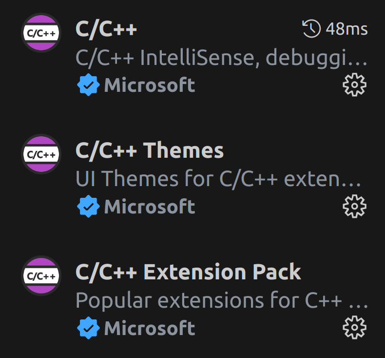
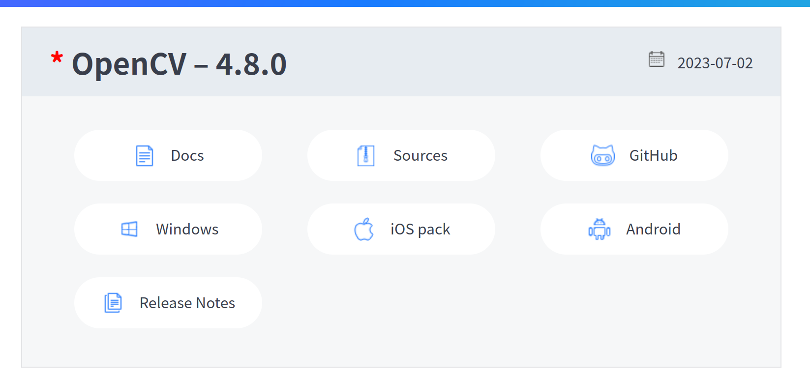
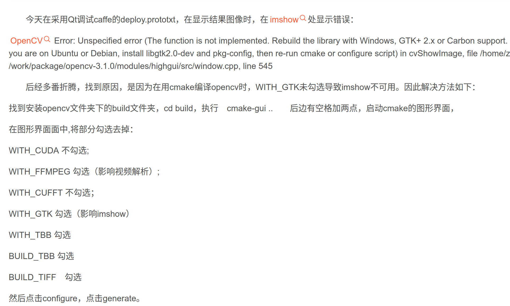

### 今天上午的内容
- cmake准备
- cmake c++单文件编译
- cmake 多文件编译
### 准备
CMake是一个跨平台的编译(Build)工具，可以用简单的语句来描述所有平台的编译过程

假如我们有一个深度学习框架的部分工程列表，里面有超过40个互相调用的工程共同组成，一些用于生成库文件，一些用于实现逻辑功能。他们之间的调用关系复杂而严格，如果我想在这样复杂的框架下进行二次开发，显然只拥有它的源码是远远不够的，还需要清楚的明白这几十个项目之间的复杂关系，在没有原作者的帮助下进行这项工作几乎是不可能的

即使是原作者给出了相关的结构文档，对新手来说建立工程的过程依旧是漫长而艰辛的，因此CMake的作用就凸显出来了。原作者只需要生成一份CMakeLists.txt文档，框架的使用者们只需要在下载源码的同时下载作者提供的CMakeLists.txt，就可以利用CMake直接进行工程的搭建

#### 下载Vscode
虚拟机下载Vscode[下载链接](https://code.visualstudio.com/)

选择`.deb`安装包

安装完成在终端输入`code`启动

推荐安装


#### 下载Cmake
[获取Cmake](https://cmake.org/download/)

虚拟机下载Linux x86_64，cmake-3.27.4-linux-x86_64.sh，下载完成赋予执行权限，运行

#### 配置环境变量
`export`命令可以用来设置或显示环境变量。在shell中，当一个变量创建时，只会在当前的shell中有效，之后创建的子进程不会有该变量

使用`export`实现添加环境变量
```shell
export PATH="cmake安装文件夹下bin文件夹的路径:$PATH"
```
运行这行命令后能够执行`cmake`命令，尝试关闭终端再开启发现`cmake`命令又不能执行

这是因为命令`export`可以将一个shell变量变成环境变量，在随后创建的子进程中也能访问到该环境变量，但是子进程在修改了环境变量的值之后，父进程并不能知道，因为子进程是复制的父进程中的环境变量。因此，当shell退出时，那些在该shell中export出来的环境变量也会消失

所以通过`export`命令可以实现将指定路径添加到环境变量，但添加完成后只能在当前shell中使用

如果想要永久生效，可以通过编辑`~/.bashrc`脚本文件实现。
为了加载你的配置， Linux的默认终端 bash 在每次启动时都会加载 `.bashrc` 文件的内容。每个用户的 home 目录都有 `.bashrc` 文件，它用来存储并加载你的终端配置。将命令写在这个文件里可以在终端开启时自动执行，从而实现添加环境变量的效果

将`export`命令加入`~/.bashrc`，放在末尾即可，你可以通过文本编辑器添加，或使用`echo`命令和`>>`输出重定向实现
```shell
echo "source /opt/ros/foxy/setup.bash" >> ~/.bashrc
```
设置完成后，每次打开终端都能直接用 `cmake` 命令了

你可能发现当前终端还是找不到`cmake`命令，这是因为终端不知道环境变量被修改了，需要通过 `source ~/.bashrc` 更新
> **参考文章**<br>
> [CMake是什么？有什么用？](https://blog.csdn.net/Torres_10/article/details/80371425)<br>
> [什么是 .bashrc，为什么要编辑 .bashrc？ | Linux 中国](https://zhuanlan.zhihu.com/p/33546077)<br>
> [Linux常用命令13 - echo](https://zhuanlan.zhihu.com/p/122562302)
### 单文件编译
现在编写一个简单的c++程序，只包含一个源文件`<你的文件名>.cpp`，你可以自己写一个或者直接用examples/cmake目录中minimum_project 中的源码

然后在源码所在的相同路径下创建`CMakeLists.txt`，注意大小写和`s`

`CMakeLists.txt`内容：
```cmake
#设置cmake的版本要求，这里指定cmake版本要高于3.10
cmake_minimum_required(VERSION 3.10)
#设置工程名称
project(Starter)
#添加要编译的源码
add_executable(Starter main.cpp)
```
cmake编译生成的文件将存放在执行命令时所在的目录下，为了防止文件杂乱，建议建立build目录，在build目录下再执行cmake指令

在CMakeLists.txt所在目录下创建build目录，
进入build目录，执行
```shell
cmake <CMakeLists.txt所在的目录>
```
这时cmake产生Makefile等文件，再执行`make`命令或者`cmake --build .`，就能在build目录下看到可执行文件

使用`./`尝试运行编译出来的文件，如果你用的是examples目录中minimum_project 中的源码，那么这是一个求两数最大公因数的程序，执行时要同时输入两个数字

### 简单多文件编译
#### 同一目录下编译
要编译的源文件在同一目录下，这时只需要在`add_executable`中增加指定源文件即可(原来只指定了main.cpp，现在新增gcd.cpp)

尝试自行编写CMakeLists，编译examples/cmake/multi_file_compile/same_dir目录下的源码，运行效果和上一节minimum_project中效果相同

如果同一个文件夹下，特别多的源文件怎么办呢？

这时可以使用aux_source_directory命令
```cmake
aux_source_directory(<dir> <variable>)
```
下面是一个使用这个命令编译examples/cmake/multi_file_compile/same_dir目录下的源码的示例：
```cmake
cmake_minimum_required(VERSION 3.10)
project(MULGCD)
#将当前目录下所有文件加入变量EXEC_FILES
aux_source_directory(. EXEC_FILES)

add_executable(MULGCD ${EXEC_FILES})
```
#### 不同目录下编译
这是examples/cmake/multi_file_compile/diff_dir目录下源码的结构层次
```
./diff_dir
    |
    +--- main.cpp
    |
    +--- math_lib/
          |
          +--- gcd.cpp
          |
          +--- gcd.h
```
我们可以看到要编译的源文件不在同一级目录下

对于这种情况，需要分别在项目根目录 diff_dir 和 math_lib 目录里各编写一个 CMakeLists.txt 文件。我们可以将 math 目录里的文件编译成静态库，由 main 函数调用

diff_dir目录下的CMakeLists.txt：
```cmake
cmake_minimum_required(VERSION 3.10)
project(GCD)
aux_source_directory(. ALL_SRCS)			
# 添加当前目录下所有的源文件
add_subdirectory(math_lib)						
# 添加math_lib子目录
add_executable(GCD ${ALL_SRCS})	
# 指定生成目标，注意这里要用${ALL_SRCS}
target_link_libraries(GCD gcd)	
# 添加链接库，gcd是在子目录math_lib的CMakeLists中定义的
```
命令add_subdirectory 指明本项目包含一个子目录 math，这样 math 目录下的 CMakeLists.txt 文件和源代码也会被处理 。

命令 target_link_libraries 指明可执行文件 main 需要连接一个名为 power 的链接库 

math_lib目录下的CMakeLists.txt:
```cmake
aux_source_directory(. LIB_SRCS)			
# 添加当前目录下所有的源文件
add_library (gcd ${LIB_SRCS})				
# 当前目录下的文件生成一个链接库
```
这里不需要再重复指定版本号等等，只需要把文件都包含进来，然后生成一个链接库即可，子目录中的CMakeLists本质上是去生成一个链接库
### task
- 使用examples目录中的源码尝试单文件编译、多文件同目录编译、多文件不同目录编译
- 写一个简单的多文件C/C++程序，然后对写的程序进行多文件不同目录编译
### 使用OpenCV-C++开发
我们两周前有使用OpenCV-Python开发，熟悉了OpenCV的API，这周我们开始使用Open-C++，比赛时的实战代码基本是用Open-C++开发的
#### 编译OpenCV-C++源码
[点击下载OpenCV源码](https://opencv.org/releases/)

选择Sources下载源码(在虚拟机里操作)

解压压缩包，进入解压出的目录，创建build文件夹
执行`cmake-gui`，勾选若干选项


然后用make对cmake生成的makefiles进行编译：
```shell
make -j $(nproc)
```
其中`nproc`是一个bash命令，会返回当前电脑最大可使用的线程数。-j参数则是以指定线程数编译。这个命令效果是自动以最大线程数编译，多线程编译大大节省时间

用make进行安装
```shell
sudo make install
```
#### 使用OpenCV-C++
https://zhuanlan.zhihu.com/p/483604320


